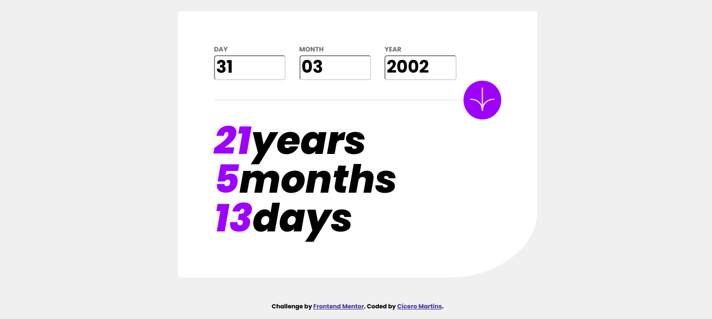

# 🇺🇸 Challenge Frontend Mentor - Age Calculator App Solution

🇺🇸 This is a solution to the [Age calculator app challenge on Frontend Mentor](https://www.frontendmentor.io/challenges/age-calculator-app-dF9DFFpj-Q). Frontend Mentor challenges help you improve your coding skills by building realistic projects. 

## Table of contents

- [Overview](#overview)
  - [The challenge](#the-challenge)
  - [Screenshot](#screenshot)
  - [Links](#links)
- [My process](#my-process)
  - [Built with](#built-with)
- [Author](#author)

## Overview

### The challenge

Users should be able to:

- View an age in years, months, and days after submitting a valid date through the form
- Receive validation errors if:
  - Any field is empty when the form is submitted
  - The day number is not between 1-31
  - The month number is not between 1-12
  - The year is in the future
  - The date is invalid e.g. 31/04/1991 (there are 30 days in April)
- View the optimal layout for the interface depending on their device's screen size
- See hover and focus states for all interactive elements on the page
- **Bonus**: See the age numbers animate to their final number when the form is submitted

### Screenshot

### Links

- Live Site URL: [Age Calculator App](https://ciceromartinsdev.github.io/age-calculator-app/)

## My process

### Built with

- Semantic HTML5
- CSS custom properties
- Flexbox
- Mobile-First Workflow

## Author

- LinkedIn - [Cícero Martins](https://www.linkedin.com/in/ciceromartinsdev/)
- Frontend Mentor - [@ciceromartinsdev](https://www.frontendmentor.io/profile/ciceromartinsdev)
- Instagram - [@ciceromartinsdev](https://www.instagram.com/ciceromartinsdev/)

# 🇧🇷 Desafio Frontend - Calculadora de Idade

🇧🇷 Esta é uma solução para o [desafio do aplicativo Calculadora de idade no Frontend Mentor](https://www.frontendmentor.io/challenges/age-calculator-app-dF9DFFpj-Q). Os desafios do Frontend Mentor ajudam você a melhorar suas habilidades de codificação através da construção de projetos realistas.

## Sumário

- [Resumo](#resumo)
  - [O Desafio](#o-desafio)
  - [Imagens](#imagens)
  - [Links](#links)
- [Desenvolvimento](#desenvolvimento)
  - [Tecnologias](#tecnologias)
- [Desenvolvedor](#desenvolvedor)

## Resumo

### O Desafio

Os usuários devem ser capazes de:

- Ver a idade em anos, meses e dias após enviar uma data válida por meio do formulário
- Receba erros de validação se:
    - Qualquer campo está vazio quando o formulário é enviado
    - O número do dia não está entre 1-31
    - O número do mês não está entre 1-12
    - O ano está no futuro
    - A data é inválida, por ex. 31/04/1991 (são 30 dias em abril)
- Veja o layout ideal da interface dependendo do tamanho da tela do dispositivo
- Veja os estados de foco e foco para todos os elementos interativos na página
- **Bônus**: veja os números das idades animados até o número final quando o formulário for enviado

### Imagens

### Links

- Endereço do Site: [Age Calculator App](https://ciceromartinsdev.github.io/age-calculator-app/)

## Desenvolvimento

### Tecnologias

- HTML5
- CSS3
- Flexbox
- Mobile First Design

## Desenvolvedor

- LinkedIn - [Cícero Martins](https://www.linkedin.com/in/ciceromartinsdev/)
- Frontend Mentor - [@ciceromartinsdev](https://www.frontendmentor.io/profile/ciceromartinsdev)
- Instagram - [@ciceromartinsdev](https://www.instagram.com/ciceromartinsdev/)

